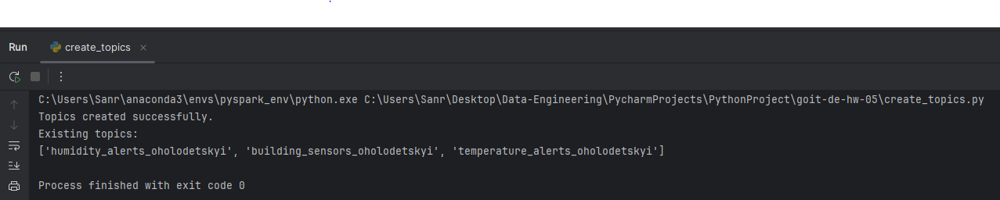
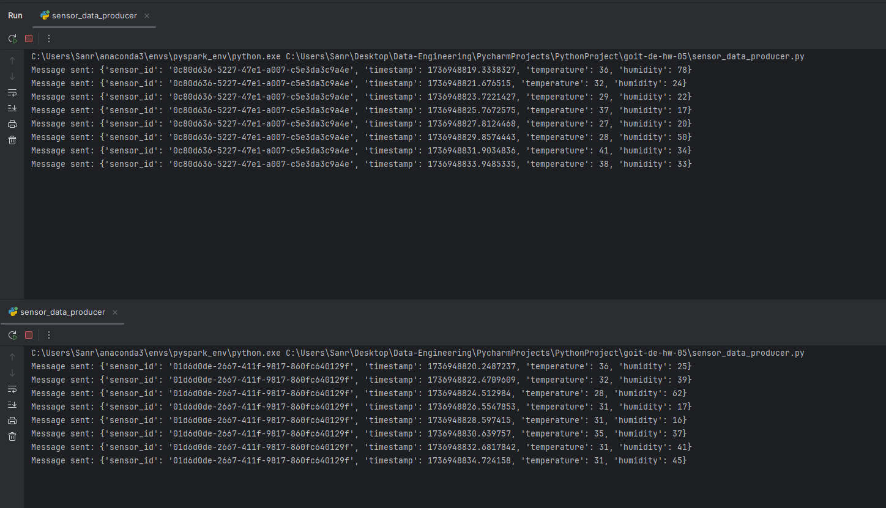
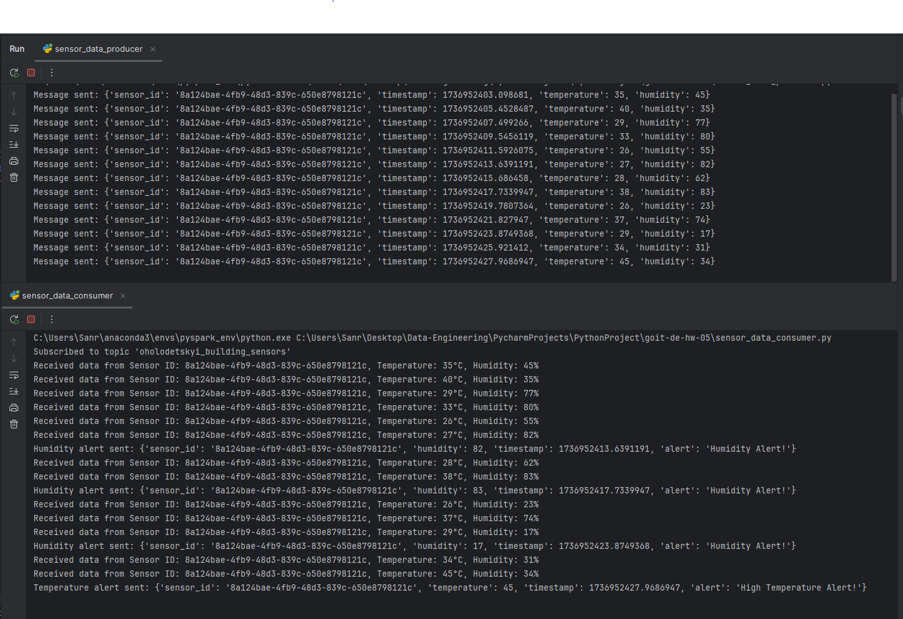
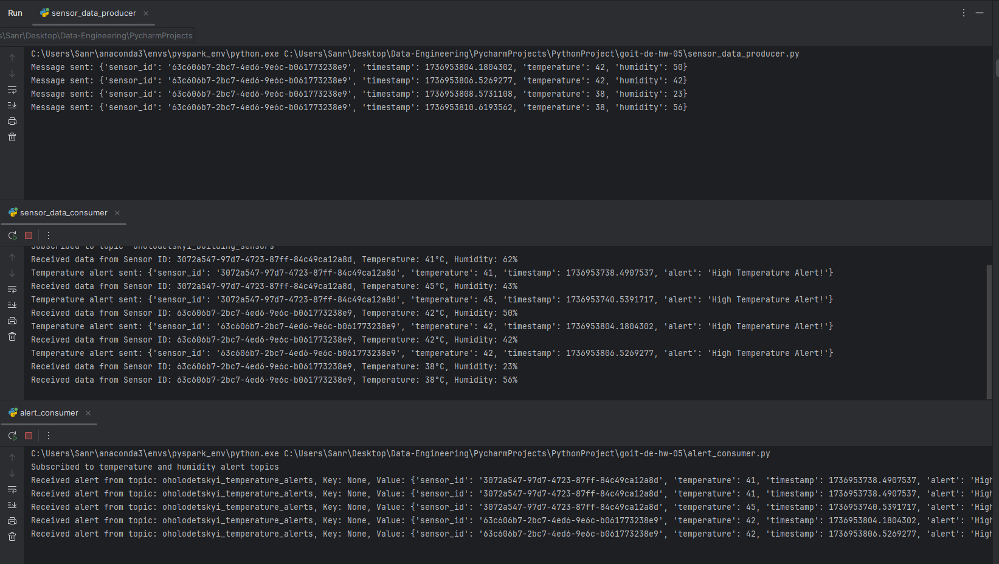
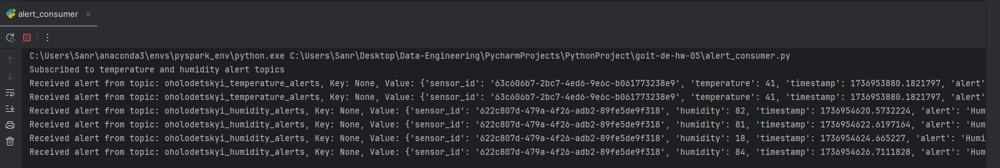

Перелік скріншотів із поясненням, які пункти завдання вони підтверджують:

1. Виведення з підтвердженням створених  трьох топіків

2. Виведення генерації даних сенсорів та відправки даних в building_sensors з демонстрацією двох (або більше) 
одночасних роботи двох запусків програми

3. Отриманням даних та фільтрацією повідомлень із building_sensors

4. Відправка відфільтрованих даних у відповідні топіки (temperature_alerts та humidity_alerts)

5. Виведення  результатів у alert_consumer.py. 
Тобто підтвердження, що дані були успішно отримані з топіків temperature_alerts та humidity_alerts і виведені на екран

